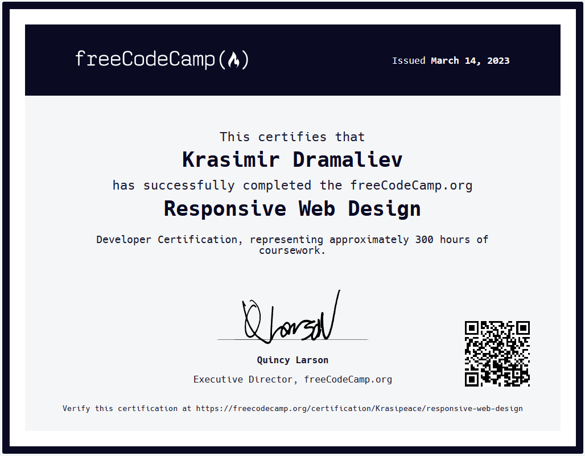

# [Responsive Web Design - freecodecamp](https://www.freecodecamp.org/learn/2022/responsive-web-design/)

 HTML and CSS 

In this Responsive Web Design Certification, you'll learn the languages that developers use to build webpages: HTML (Hypertext Markup Language) for content, and CSS (Cascading Style Sheets) for design.

First, you'll build a cat photo app to learn the basics of HTML and CSS. Later, you'll learn modern techniques like CSS variables by building a penguin, and best practices for accessibility by building a quiz site.

Finally, you'll learn how to make webpages that respond to different screen sizes by building a photo gallery with Flexbox, and a magazine article layout with CSS Grid.

#### Exercises:
| | Name | Preview |
| ---: | :--- | :---: |
| 1 | [Cat Photo App][1]               | [demo][16] |
| 2 | [Cafe Menu][2]                   | [demo][17] |
| 3 | [Set of Colored Markers Page][3] | [demo][18] |
| 4 | [Registration Form][4]           | [demo][19] |
| 5 | [Rothko Painting][5]             | [demo][20] |
| 6 | [Photo Gallery][6]               | [demo][21] |
| 7 | [Nutrition Label][7]             | [demo][22] |
| 8 | [Quiz][8]                        | [demo][23] |
| 9 | [Balance Sheet][9]               | [demo][24] |
| 10 | [Picasso Painting][10]          | [demo][25] |
| 11 | [Piano][11]                     | [demo][26] |
| 12 | [City Skyline][12]              | [demo][27] |
| 13 | [Magazine][13]                  | [demo][28] |
| 14 | [Ferris Wheel][14]              | [demo][29] |
| 15 | [Penguin][15]                   | [demo][30] |

#### Projects:
|  | Name | Preview |
| ---: | :--- | :---: |
| 1 | [Survey Form][31]                  | [demo][36] |
| 2 | [Tribute Page][32]                 | [demo][37] |
| 3 | [Technical Documentation Page][33] | [demo][38] |
| 4 | [Product Landing Page][34]         | [demo][39] |
| 5 | [Personal Portfolio Webpage][35]   | [demo][40] |

[1]: https://github.com/Krasipeace/Responsive-Web-Design---freecodecamp/blob/main/1.%20Cat%20Photo%20App/index.html
[2]: https://github.com/Krasipeace/Responsive-Web-Design---freecodecamp/tree/main/2.%20Cafe%20Menu
[3]: https://github.com/Krasipeace/Responsive-Web-Design---freecodecamp/tree/main/3.%20Colored%20Markers
[4]: https://github.com/Krasipeace/Responsive-Web-Design---freecodecamp/tree/main/4.%20Registration%20Form 
[5]: https://github.com/Krasipeace/Responsive-Web-Design---freecodecamp/tree/main/6.%20Rothko%20Painting
[6]: https://github.com/Krasipeace/Responsive-Web-Design---freecodecamp/tree/main/7.%20Photo%20Gallery
[7]: https://github.com/Krasipeace/Responsive-Web-Design---freecodecamp/tree/main/8.%20Nutrition%20Label
[8]: https://github.com/Krasipeace/Responsive-Web-Design---freecodecamp/tree/main/9.%20Quiz
[9]: https://github.com/Krasipeace/Responsive-Web-Design---freecodecamp/tree/main/11.%20Balance%20Sheet
[10]: https://github.com/Krasipeace/Responsive-Web-Design---freecodecamp/tree/main/12.%20Picasso%20Painting
[11]: https://github.com/Krasipeace/Responsive-Web-Design---freecodecamp/tree/main/13.%20Piano
[12]: https://github.com/Krasipeace/Responsive-Web-Design---freecodecamp/tree/main/15.%20City%20Skyline
[13]: https://github.com/Krasipeace/Responsive-Web-Design---freecodecamp/tree/main/16.%20Magazine
[14]: https://github.com/Krasipeace/Responsive-Web-Design---freecodecamp/tree/main/18.%20Ferris%20Wheel
[15]: https://github.com/Krasipeace/Responsive-Web-Design---freecodecamp/tree/main/19.%20Penguin

[16]: https://htmlpreview.github.io/?https://github.com/Krasipeace/Responsive-Web-Design---freecodecamp/blob/main/1.%20Cat%20Photo%20App/index.html
[17]: https://htmlpreview.github.io/?https://github.com/Krasipeace/Responsive-Web-Design---freecodecamp/blob/main/2.%20Cafe%20Menu/index.html
[18]: https://htmlpreview.github.io/?https://github.com/Krasipeace/Responsive-Web-Design---freecodecamp/blob/main/3.%20Colored%20Markers/index.html
[19]: https://htmlpreview.github.io/?https://github.com/Krasipeace/Responsive-Web-Design---freecodecamp/blob/main/4.%20Registration%20Form/index.html 
[20]: https://htmlpreview.github.io/?https://github.com/Krasipeace/Responsive-Web-Design---freecodecamp/blob/main/6.%20Rothko%20Painting/index.html
[21]: https://htmlpreview.github.io/?https://github.com/Krasipeace/Responsive-Web-Design---freecodecamp/blob/main/7.%20Photo%20Gallery/index.html
[22]: https://htmlpreview.github.io/?https://github.com/Krasipeace/Responsive-Web-Design---freecodecamp/blob/main/8.%20Nutrition%20Label/index.html
[23]: https://htmlpreview.github.io/?https://github.com/Krasipeace/Responsive-Web-Design---freecodecamp/blob/main/9.%20Quiz/index.html
[24]: https://htmlpreview.github.io/?https://github.com/Krasipeace/Responsive-Web-Design---freecodecamp/blob/main/11.%20Balance%20Sheet/index.html
[25]: https://htmlpreview.github.io/?https://github.com/Krasipeace/Responsive-Web-Design---freecodecamp/blob/main/12.%20Picasso%20Painting/index.html
[26]: https://htmlpreview.github.io/?https://github.com/Krasipeace/Responsive-Web-Design---freecodecamp/blob/main/13.%20Piano/index.html
[27]: https://htmlpreview.github.io/?https://github.com/Krasipeace/Responsive-Web-Design---freecodecamp/blob/main/15.%20City%20Skyline/index.html
[28]: https://htmlpreview.github.io/?https://github.com/Krasipeace/Responsive-Web-Design---freecodecamp/blob/main/16.%20Magazine/index.html
[29]: https://htmlpreview.github.io/?https://github.com/Krasipeace/Responsive-Web-Design---freecodecamp/blob/main/18.%20Ferris%20Wheel/index.html
[30]: https://htmlpreview.github.io/?https://github.com/Krasipeace/Responsive-Web-Design---freecodecamp/blob/main/19.%20Penguin/index.html

[31]: https://github.com/Krasipeace/Responsive-Web-Design---freecodecamp/tree/main/5.%20Survey%20Form
[32]: https://github.com/Krasipeace/Responsive-Web-Design---freecodecamp/tree/main/10.%20Tribute%20Page
[33]: https://github.com/Krasipeace/Responsive-Web-Design---freecodecamp/tree/main/14.%20Technical%20Documentation%20Page
[34]: https://github.com/Krasipeace/Responsive-Web-Design---freecodecamp/tree/main/17.%20Product%20Landing%20Page
[35]: https://github.com/Krasipeace/Responsive-Web-Design---freecodecamp/tree/main/20.%20Personal%20Portfolio%20Webpage

[36]: https://htmlpreview.github.io/?https://github.com/Krasipeace/Responsive-Web-Design---freecodecamp/blob/main/5.%20Survey%20Form/index.html
[37]: https://htmlpreview.github.io/?https://github.com/Krasipeace/Responsive-Web-Design---freecodecamp/blob/main/10.%20Tribute%20Page/index.html
[38]: https://htmlpreview.github.io/?https://github.com/Krasipeace/Responsive-Web-Design---freecodecamp/blob/main/14.%20Technical%20Documentation%20Page/index.html
[39]: https://htmlpreview.github.io/?https://github.com/Krasipeace/Responsive-Web-Design---freecodecamp/blob/main/17.%20Product%20Landing%20Page/index.html
[40]: https://htmlpreview.github.io/?https://github.com/Krasipeace/Responsive-Web-Design---freecodecamp/blob/main/20.%20Personal%20Portfolio%20Webpage/index.html

